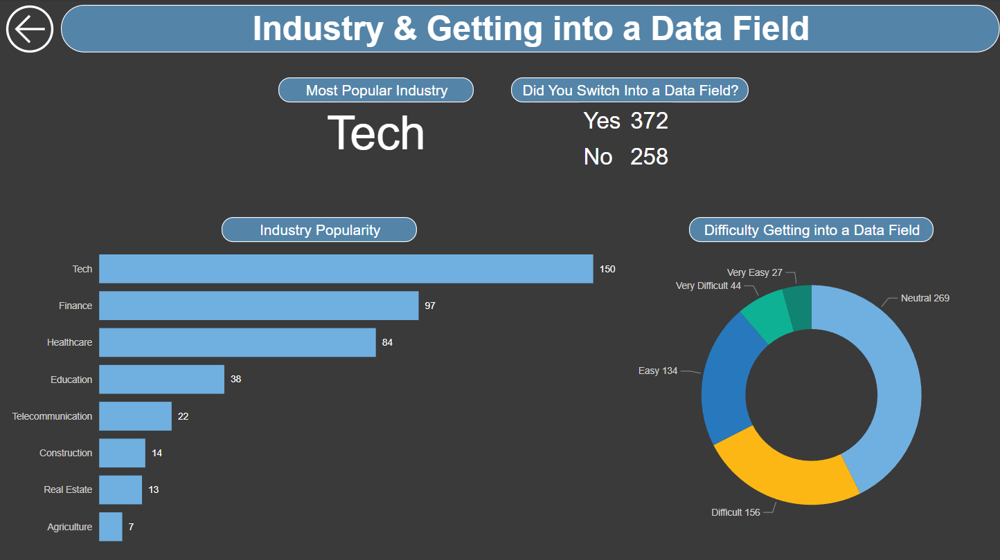
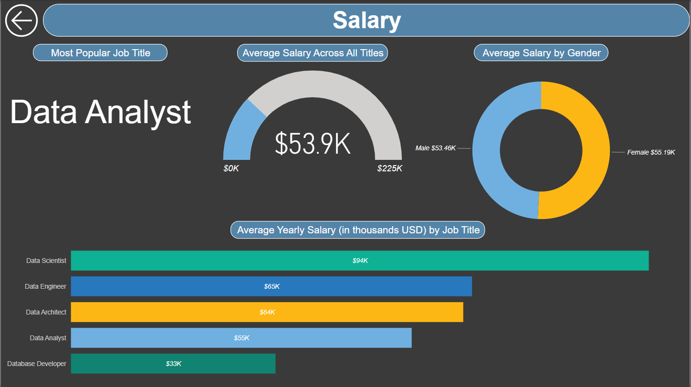

# 📝 Data Professional Survey Visualization

## 📁 Dataset and Power BI Files

Original dataset provided by [Alex the Analyst](https://github.com/AlexTheAnalyst/Power-BI/blob/main/Power%20BI%20-%20Final%20Project.xlsx), you can download my cleaned survey results [here](https://github.com/josephhmltn/Data_Professional_Survey/blob/main/Data%20professional%20survey%20results.xlsx), or download my finished Power BI (.pbix) file [here](https://github.com/josephhmltn/Data_Professional_Survey/blob/main/Data%20Professional%20Survey.pbix).

## 🎯 Project Goal for Data Professional Survey Analysis

- **Objective**: To provide a comprehensive analysis of the Data Professional Survey that captures the demographic, professional, and sentiment trends among participants, leveraging the data to inform industry standards and contribute to the discourse on workplace satisfaction, diversity, and salary equity.

## 📊 Descriptive Statistics of Data Professional Survey Excel Workbook

- **👥 Respondents**: **630** unique participants.
- **📅 Survey Dates**: Taken over **16 unique dates**, with the most submissions on **6/10/2022**.
- **⏰ Response Times**: **203 different time stamps** for survey completion.
- **🔢 Age Range**: Respondents aged from **18 to 92**, with an average age of **30**.
- **🌎 Country Diversity**: Participants are predominantly from the **United States**.
- **🎓 Education Levels**: **5 distinct levels** reported, **Bachelor's** degree being the most common.
- **✨ Ethnicity**: **45 unique ethnicities**, with **White or Caucasian** being the most reported.

## 🌐 Data Professional Survey Respondent Snapshot

- **👥 630 Unique Participants**: A diverse group with an average age of **30**.
- **📅 16-Day Survey Duration**: Captured a snapshot of professionals' insights.
- **🌎 Country Representation**: Majority from the **United States (41.43%)**.
- **🎨 Ethnic Diversity**: Predominantly **White or Caucasian (239 respondents)**, with significant **Asian or Asian American (155 respondents)** representation.
- **🚹🚺 Gender Breakdown**: More **males (468)** than **females (162)** participated in the survey.

## 🏫 Education Analysis Overview

- 📈 **Highest Average Salary**: Those with a PhD have the highest average salary at **$124,700**.
- 🎓 **Most Common Education Level**: Bachelor's degree is the most common education level with **329** individuals.
- 👩‍🎓 **Female Education**: Majority of females reported having a Master's degree (**70** out of 91).
- 👨‍🎓 **Male Education**: Bachelor's degree is the most common for males with **257** out of 454.
- 🧑‍💼 **Data Analysts by Education**: Most Data Analysts have a Bachelor's degree (**203** out of 368).

## 🛠️ Technical Skills Proficiency Among Data Professionals

- **🐍 Python Dominance**: With **420 mentions**, Python is the most popular programming language.
- **📊 R**: Holds a distant second place, preferred by **101 professionals**.
- **🔧 Other Languages**: **95** respondents work with a variety of other programming languages.
- **🧩 C/C++ and JavaScript**: Significantly less popular among the surveyed, with only **7 and 6 mentions**, respectively.
- **☕ Java**: Just **1 mention**, indicating minimal use in the data profession.

## 🏭 Industry and Getting Into the Data Field

- **Tech** dominates the industry type with **150 people**.
- **Finance** and **Healthcare** are the next closest with **97** and **84 people** respectively.
- **372 people** reported switching into a Data Field and **258 people** stayed within the field.
- **269 people** say they are **Neutral** about the difficulty getting into the field, with **156 people** stating it being difficult and **134 people** saying it was easy. 

## 💵 Salary Breakdown for Data Roles

- **📊 Average Salary for Data Analysts**: **$53.9K** across all titles.
- **👩‍💼👨‍💼 Gender Pay Gap**: Average salary for females is **$55.1K**, while males earn **$53.46K**.

### 🏷️ Average Yearly Salary by Job Title

- **🔬 Data Scientist**: Tops the chart with **$94K**.
- **⚙️ Data Engineer**: Follows with **$66K**.
- **🏗️ Data Architect**: Earns an average of **$64K**.
- **📈 Data Analyst**: **$55K**, the most popular title.
- **💾 Database Developer**: Has an average salary of **$33K**, potential data issues.

## 😊 Happiness Breakdown in Data Professionals

- **💼 Work/Life Balance**: Average score of **6/10**.
- **🎓 Learning Opportunities**: More positive with a score of **6/10**.
- **👥 Coworkers**: Collaboration and peer interaction also scored **6/10**.
- **💵 Salary Satisfaction**: Lower at **4/10**, indicating room for improvement.
- **🔝 Upward Mobility**: Another area with potential for growth, scoring **5/10**.
- **👨‍💼 Management**: Ties with upward mobility at a **5/10** score.

### 📊 Average Happiness by Industry

**Common Theme**: Across all industries, happiness with **salary and upward mobility/advancement** is lowest.

- ❤️‍🩹 **Healthcare**: Shows balance across all aspects, with **learning and Work/Life Balance** rated highest.
- 🏠 **Real Estate**: Notably lower **salary** satisfaction.
- 💰 **Finance**: Scores moderately well, with **salary** being the lowest.
- ⚙️ **Tech**: Strong in **Coworkers, learning, and work/life balance**, weaker in **salary satisfaction**.
- 🏫 **Education**: **Salary satisfaction** could be better.
- ☎️ **Telecommunication**: Similar to education, with a slight edge in **work/life balance**.
- 🚧 **Construction**: Needs improvement across all areas.
